# Python数据分析(不一定要按顺序看，不断学习不断提高代码质量，后面思路更清晰，分析结果更明了)

### （2021.4.7—2021.4.14）

* 读取csv文件，将多个csv文件合并成一个文件
  遇到的问题：数据存在NaN,在合并时要对NaN值进行处理（已解决）

```
# 合并数据
result1 =               pd.concat([DateTime,Temperature_N1_301_1,Humidity_N1_301_1,Pressure_N1_301_1,Light_N1_301_1],axis = 1)
result = result.merge(result1,how = 'outer')
```

  * 对csv文件中的时间缺失值补齐

    遇到的问题：产生完整的时间序列后，进行时间缺失值补齐时存在重复值，要**删除重复值**  （已解决）

```
# 生成完整时间序列
pdates = pd.date_range(start = df_date.index[0], end = df_date.index[-1],freq='10min')
# 删除重复值
df_date = df_date[~df_date.index.duplicated()]

```

  * 将csv文件数据进行分类处理，并用matplotlib库绘图展示

​       遇到的问题：未过滤数据中的异常值，导致画出的图有点奇怪，暂时只实现判断语句过滤异常值 （ o ）

```
# 湿度
Humidity = Humidity[Humidity <= 80]
plt.plot(pdates,Humidity)
plt.show()
```

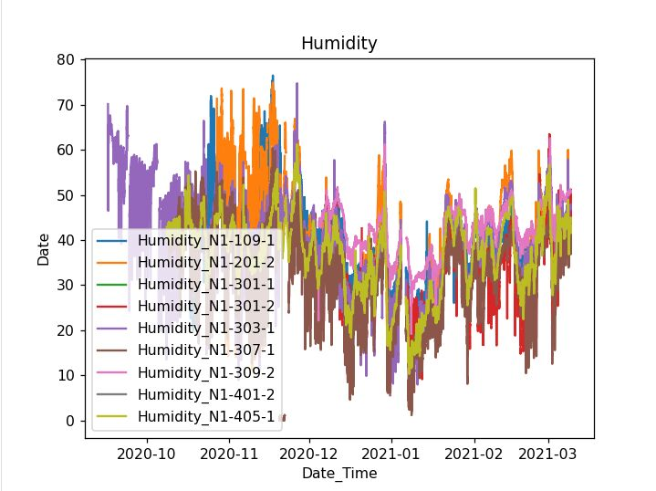

```
# 光照
Light = Answer.loc[:,Title[11:20]]
plt.plot(pdates,Light)
plt.show()
```

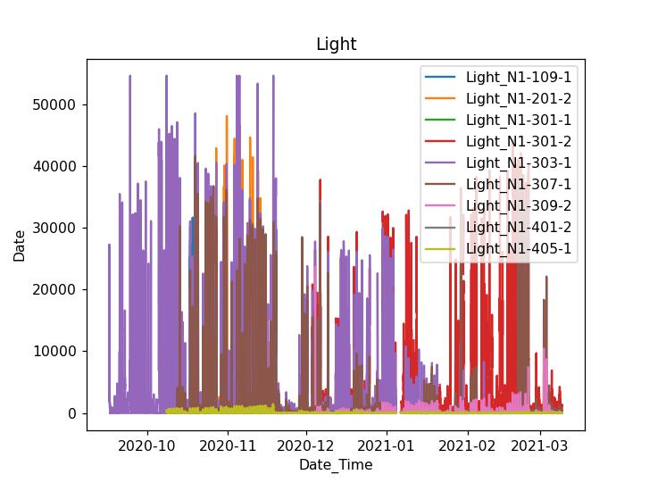

```
# 大气压
Pressure = Answer.loc[:,Title[21:30]]
Pressure = Pressure[Pressure>800]
plt.plot(pdates,Pressure)
plt.show()

```

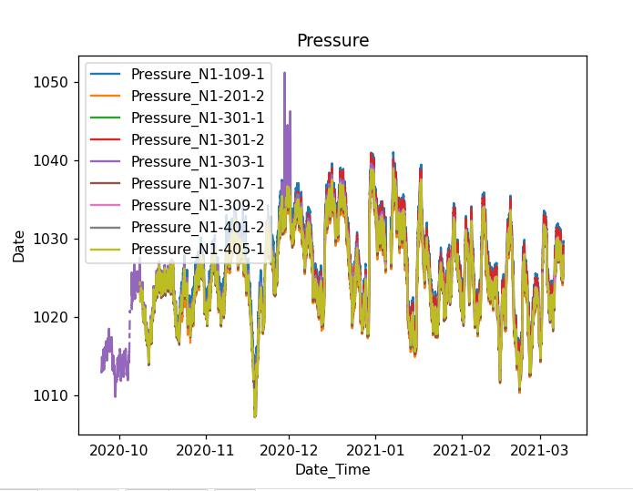

```
# 温度
Temperature = Answer.loc[:,Title[31:40]]
Temperature = Tempture[Temperature <= 40]
plt.plot(pdates,Temperature)
plt.show()
```

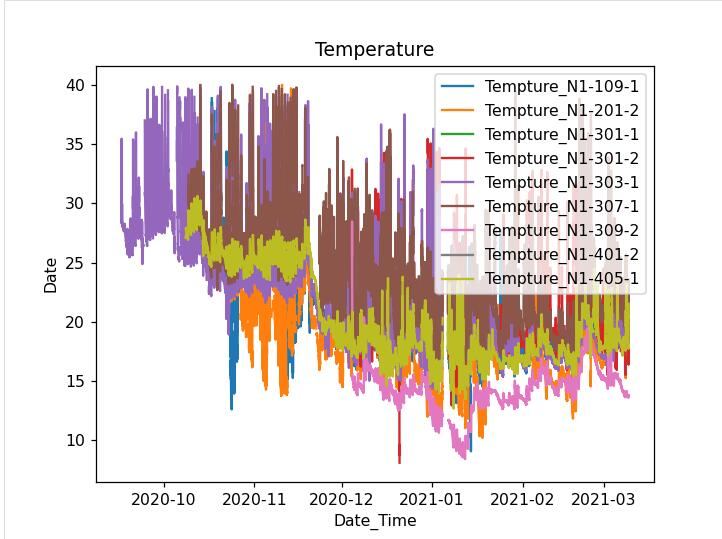

### 2021.4.15— 2021.4.23

* 重写代码，代码看起来更加清晰明了

* 过滤异常值部分添加最高值限制，使数据更加准确

* ```python
  #Pressure数据可视化
  Pressure = pd.read_csv('Pressure.csv')
  Pressure = Pressure.iloc[:,1:]
  Pressure = Pressure[(Pressure.iloc[:,:]>800)&(Pressure.iloc[:,:]<1300)]# 过滤异常值
  Pressure_Labels = Pressure.columns.tolist()
  plt.plot(Time_Series,Pressure)
  plt.legend(Pressure_Labels)
  plt.title('2020/9/16-2021/3/9 N1 Pressure Change(data update every 10 minutes)')
  plt.xlabel('2020/9/16 9:20-2021/3/9 9:50')
  plt.ylabel('Pressure_value')
  plt.show()
  ```

  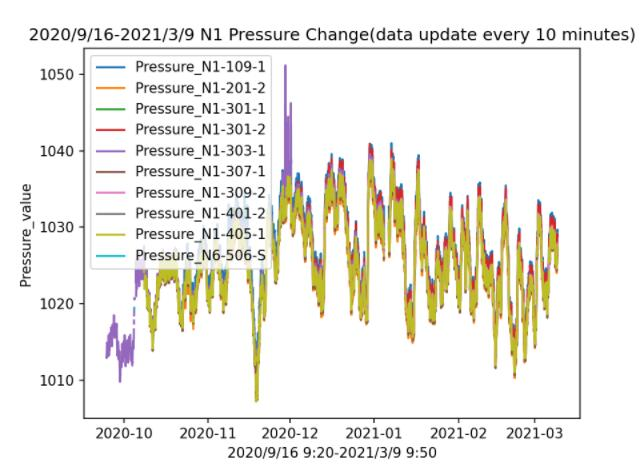

* 分析N1-3 传感器大气压数据

* （1）同一时间段传感器误差值 = 同一时间段传感器大气压数值 - 同一时间段N1-3传感器大气压平均值 

* （2）传感器误差值可视化后还是存在异常值

* （3）通过  ‘3的塔准则’    再次过滤异常值

* 结论：通过上述分析，可以得出N1_3传感器的误差 ，根据误差值可对每个传感器进行校正。

  ```python
  #Pressure N1 3 数据处理 数据可视化
  Pressure_Labels_N1_3 = Pressure_Labels[2:7]
  Pressure_N1_3 = Pressure.loc[:,Pressure_Labels_N1_3]
  Pressure_N1_3_Mean = Pressure_N1_3.mean(axis = 1)# 行平均值
  Pressure_N1_3_Std = Pressure_N1_3.std() # 标准差
  for i in range(len(Pressure_Labels_N1_3)):
      Pressure_N1_3[Pressure_Labels_N1_3[i]] -= Pressure_N1_3_Mean# Pressure_N1_3-平均值
      Min = Pressure_N1_3[Pressure_Labels_N1_3[i]].mean() - 3 * Pressure_N1_3[Pressure_Labels_N1_3[i]].std()
      Max = Pressure_N1_3[Pressure_Labels_N1_3[i]].mean() + 3 * Pressure_N1_3[Pressure_Labels_N1_3[i]].std()
      Pressure_N1_3[Pressure_Labels_N1_3[i]] = Pressure_N1_3[Pressure_Labels_N1_3[i]][(Min < Pressure_N1_3[Pressure_Labels_N1_3[i]]) & (Pressure_N1_3[Pressure_Labels_N1_3[i]] < Max)]
  Pressure_N1_3.to_csv('Data_Pressure_N1_3_afterErrorValue.csv')
  plt.plot(Time_Series,Pressure_N1_3)
  plt.legend(Pressure_Labels_N1_3)
  plt.title('2020/9/16-2021/3/9 N1 _ 3 Pressure Change(data update every 10 minutes)')
  plt.xlabel('2020/9/16 9:20-2021/3/9 9:50')
  plt.ylabel('Pressure_value')
  plt.show()
  ```

  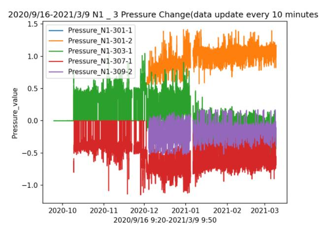
  
 * 校正前的传感器大气压数据可视化
 
 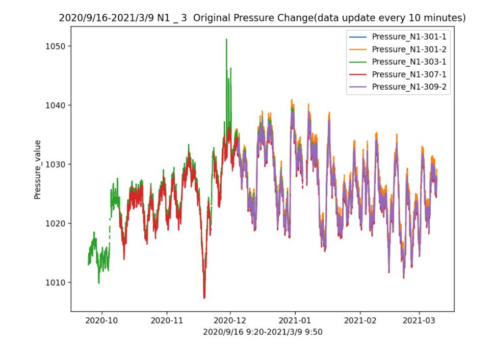
 
 * 校正数据可视化
 
 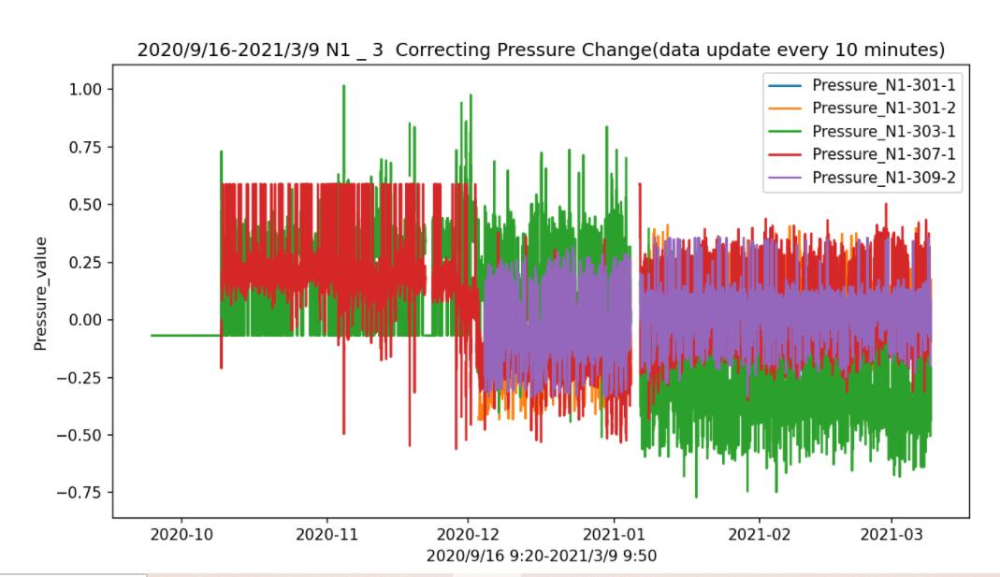
 
 * 校正后的传感器大气压数据可视化
  
  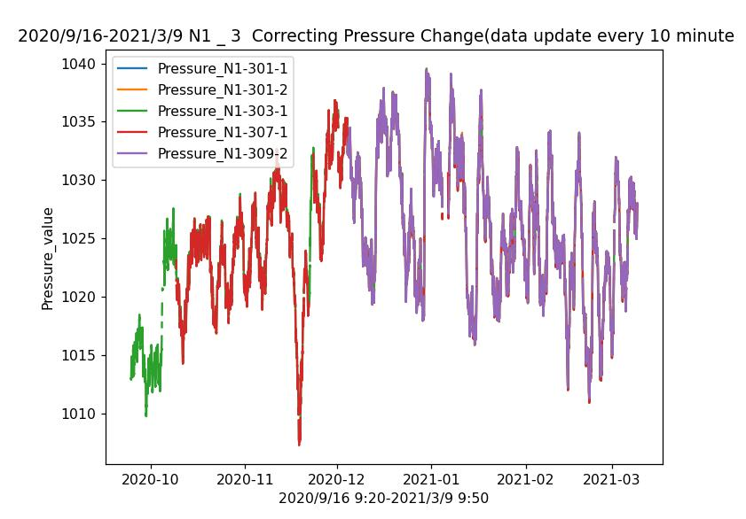
### 2021.4.24-2021.5.4（大气压数据分析最终版）

* 读出所有大气压数据并将数据可视化
  * 数据可视化之后，由于可以观察到数据的统计特征，所以可以过滤数据异常值，为接下来统计分析做铺垫
  * 过滤异常值是之后数据处理的前提，所以确定适合的数据范围尤为重要（多次尝试找出最优解）
```python
Pressure = pd.read_csv('Pressure.csv')
Pressure = Pressure.iloc[:,1:]
Pressure = Pressure[(Pressure.iloc[:,:]>1000)&(Pressure.iloc[:,:]<1100)]# 过滤异常值
Pressure_Labels = Pressure.columns.tolist()
plt.plot(Time_Series,Pressure)
plt.legend(Pressure_Labels)
plt.title('2020/9/16-2021/3/9 N1 Pressure Change(data update every 10 minutes)')
plt.xlabel('2020/9/16 9:20-2021/3/9 9:50')
plt.ylabel('Pressure_value')
plt.show()
```
<center>图  Pressure_all</center>
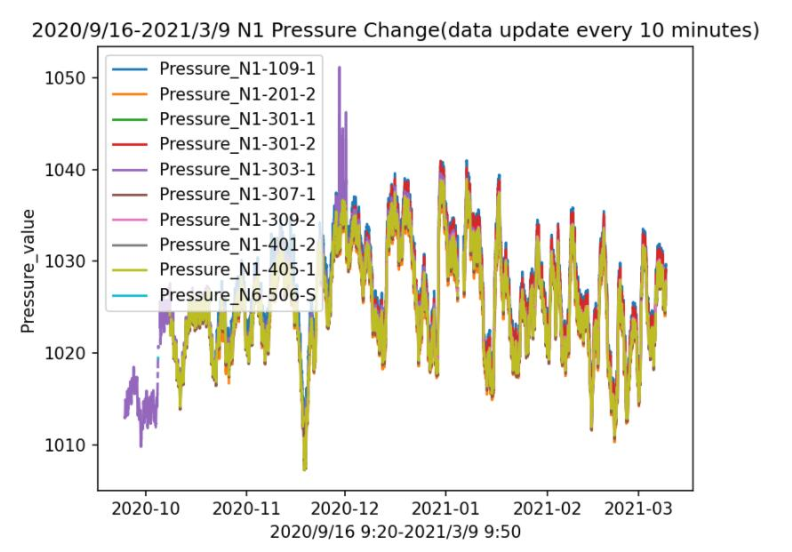

* 读出N1_3楼层大气压数据并将数据可视化，我们选取三楼数据作为分析对象（其余楼层同理）
<center>图 Pressure_N1_3</center>
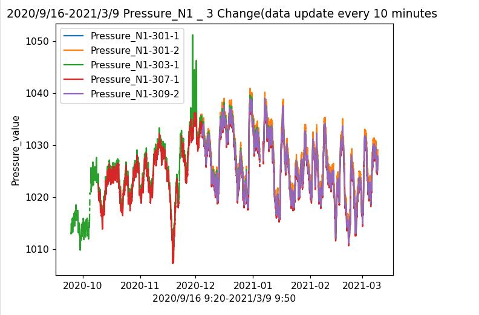


* 传感器在生产的时候都存在一定的误差，为了得到更加精确的大气压数据，需要计算每个传感器的误差值，然后根据误差值对传感器进行校正。
  * 计算传感器的误差值 （误差值 = 当前传感器数值 - 所选楼层所有传感器的平均值）

```python
Pressure_N1_3_Mean = Pressure_N1_3.mean(axis = 1) # 平均值
Pressure_N1_3_Std = Pressure_N1_3.std() # 方差
  for i in range(len(Pressure_Labels_N1_3)):
    Pressure_N1_3[Pressure_Labels_N1_3[i]] -= Pressure_N1_3_Mean # Pressure_N1_3 - 平均值
    # ’3的塔‘准则过滤误差异常值
    Min = Pressure_N1_3[Pressure_Labels_N1_3[i]].mean() - 3 * Pressure_N1_3[Pressure_Labels_N1_3[i]].std()
    Max = Pressure_N1_3[Pressure_Labels_N1_3[i]].mean() + 3 * Pressure_N1_3[Pressure_Labels_N1_3[i]].std()
	Pressure_N1_3[Pressure_Labels_N1_3[i]] = Pressure_N1_3[Pressure_Labels_N1_3[i]][(Min < Pressure_N1_3[Pressure_Labels_N1_3[i]]) & (Pressure_N1_3[Pressure_Labels_N1_3[i]] < Max)]
Pressure_N1_3_ErrorValue = Pressure_N1_3
Pressure_N1_3_ErrorValue.to_csv('Data_Pressure_N1_3_afterErrorValue.csv')
plt.plot(Time_Series,Pressure_N1_3_ErrorValue)
plt.legend(Pressure_Labels_N1_3)
plt.title('2020/9/16-2021/3/9 N1 _ 3 ErrorValue Pressure Change(data update every 10 minutes)')
plt.xlabel('2020/9/16 9:20-2021/3/9 9:50')
plt.ylabel('Pressure_value')
plt.show()
```

* 传感器误差数据可视化
<center>图 Pressure_N1_3_ErrorValue</center>
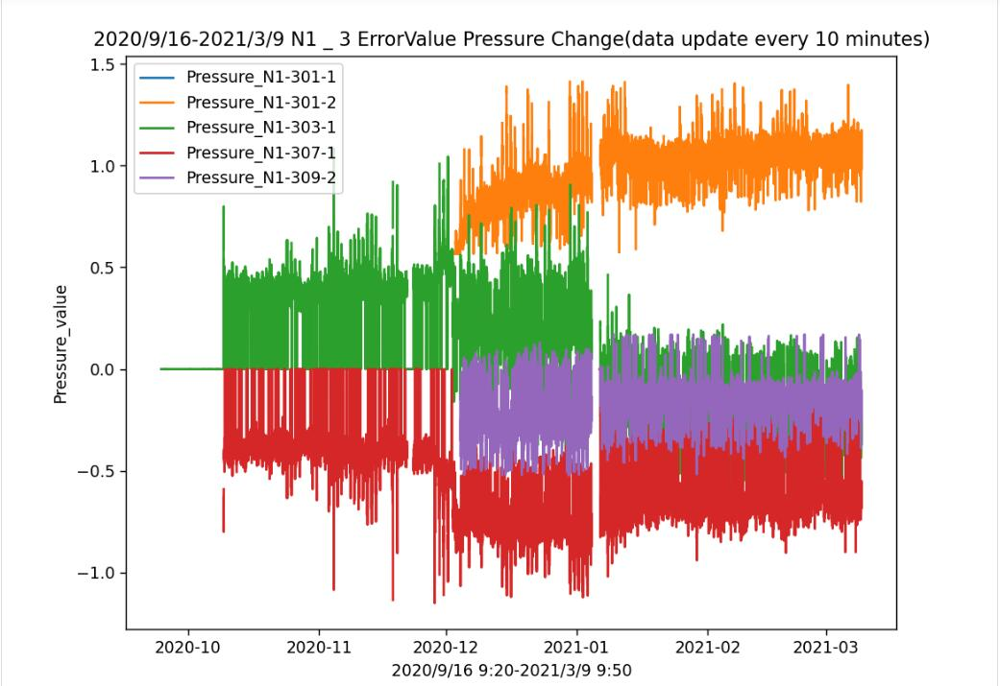

* 通过误差数据对传感器进行校正
  * 校正数据 = 原大气压数据 - 误差平均值
```python
# 通过误差值对传感器进行校正
Pressure_N1_3_Correcting_1 = Pressure.loc[:,Pressure_Labels_N1_3]
for i in range(len(Pressure_Labels_N1_3)):
    # 校正数据 = 原大气压数据 - 误差平均值
    Pressure_N1_3_Correcting_1[Pressure_Labels_N1_3[i]] -= Pressure_N1_3_ErrorValue[Pressure_Labels_N1_3[i]].mean()
plt.plot(Time_Series,Pressure_N1_3_Correcting_1)
plt.legend(Pressure_Labels_N1_3)
plt.title('2020/9/16-2021/3/9 N1 _ 3 after Correcting Pressure Change(data update every 10 minutes)')
plt.xlabel('2020/9/16 9:20-2021/3/9 9:50')
plt.ylabel('Pressure_value')
plt.show()
```
* 校正后数据可视化
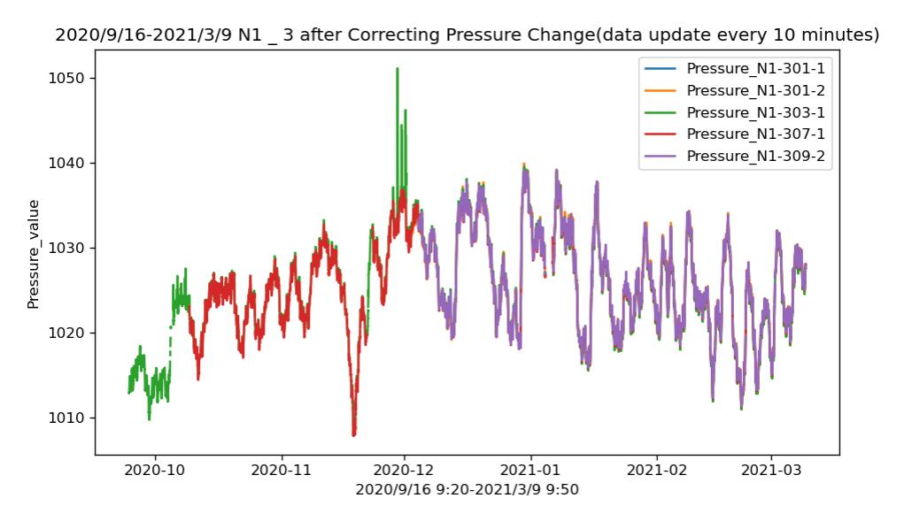
* 计算校正后传感器误差数据
  * 校正后误差值 = 校正值 - 校正平均值
```python
# 计算校正后传感器误差数据并可视化
Pressure_N1_3_Correcting_Mean = Pressure_N1_3_Correcting_1.mean(axis = 1)
# Pressure_N1_3_Correcting_1 校正后的大气压数值
for i in range(len(Pressure_Labels_N1_3)):
    # 校正误差值 = 校正值 - 校正平均值
    Pressure_N1_3_Correcting_1[Pressure_Labels_N1_3[i]] -=  Pressure_N1_3_Correcting_Mean
    # '3的塔'准则过滤校正后误差异常值
    Min = Pressure_N1_3_Correcting_1[Pressure_Labels_N1_3[i]].mean() - 3 * Pressure_N1_3_Correcting_1[Pressure_Labels_N1_3[i]].std()
    Max = Pressure_N1_3_Correcting_1[Pressure_Labels_N1_3[i]].mean() + 3 * Pressure_N1_3_Correcting_1[Pressure_Labels_N1_3[i]].std()
    Pressure_N1_3_Correcting_1[Pressure_Labels_N1_3[i]] = Pressure_N1_3_Correcting_1[Pressure_Labels_N1_3[i]][(Min < Pressure_N1_3_Correcting_1[Pressure_Labels_N1_3[i]]) & (Pressure_N1_3_Correcting_1[Pressure_Labels_N1_3[i]] < Max)]
Pressure_N1_3_ErrorValue = Pressure_N1_3
plt.plot(Time_Series,Pressure_N1_3_Correcting_1)
plt.legend(Pressure_Labels_N1_3)
plt.title('2020/9/16-2021/3/9  Pressure_N1 _ 3 _ Correcting ErrorValue Change(data update every 10 minutes)')
plt.xlabel('2020/9/16 9:20-2021/3/9 9:50')
plt.ylabel('Pressure_value')
plt.show()
```
* 校正后误差数据可视化
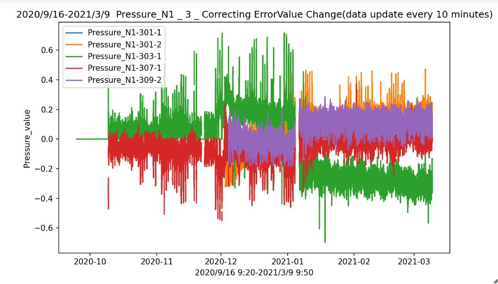
